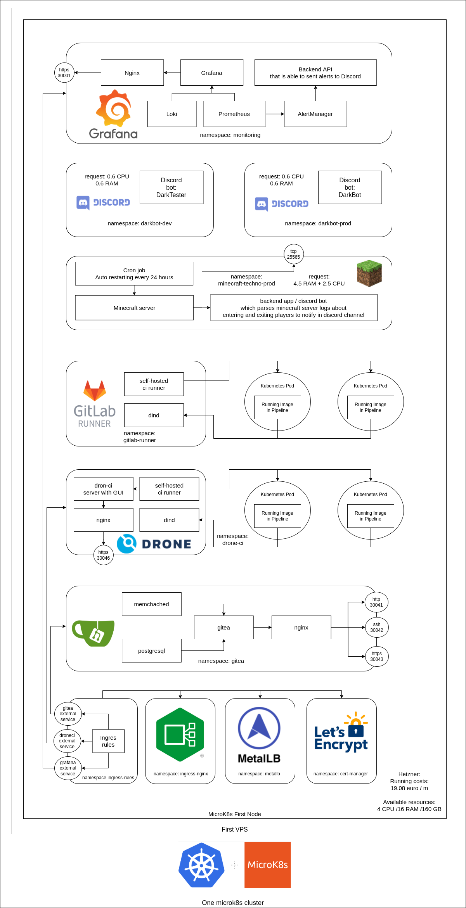

 # Description

This is a homelab for darkwind's pet projects. Exists purely for fun, learning and experiments.

# Projects:

* [infrastructure](https://github.com/darklab8/darklab_infrastructure): microk8s setting up scripts to contain the homelab

* [pipeline_images](https://github.com/darklab8/darklab_pipeline_images): darklab images for CI/CD pipelines

* [gitlab_ci](https://github.com/darklab8/darklab_gitlab_ci): self hosted gitlab CI runner with access to docker

* [drone_ci](https://github.com/darklab8/darklab_drone_ci): self hosted drone CI with access to docker

* [darkbot](https://github.com/darklab8/darklab_darkbot): discord bot for [Discovery Freelancer community](https://discoverygc.com/forums/index.php)

* [minecraft_techno_server](https://github.com/darklab8/darklab_minecraft_techno_server): minecraft server with electro technical modifications

* [goping](https://github.com/darklab8/darklab_goping): script to query same resource multiple times with one CPU in golang. Available as public docker image.

* [monitoring](https://github.com/darklab8/darklab_monitoring): Prometheus + Loki + Grafana + AlertManager

* [backups](https://github.com/darklab8/darklab_backups): some scripts to backup/restore stateful data for darkbot and minecraft server

* [gitea](https://github.com/darklab8/darklab_gitea): self hosted git, without problems running just from NodePorts

# Darklab infrastructure

